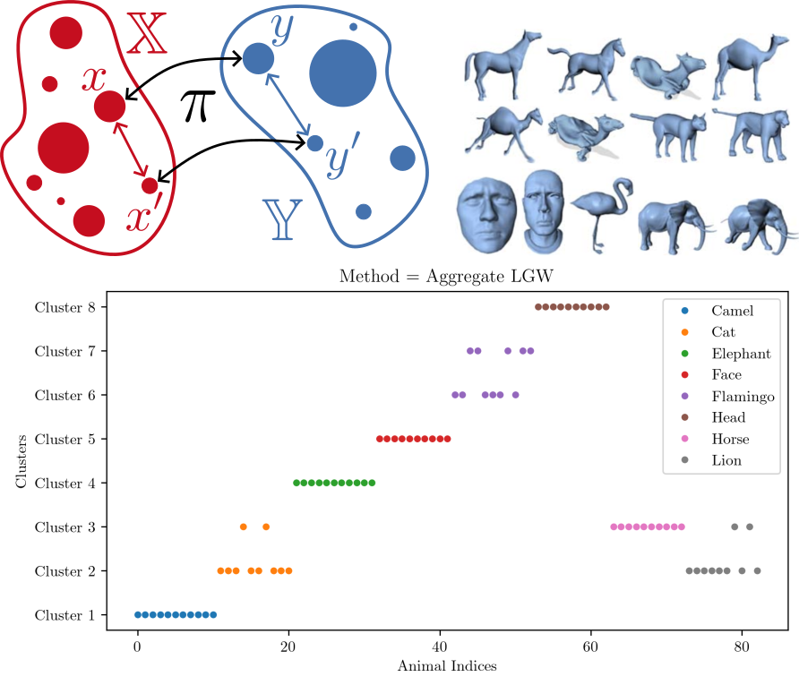

# Gromov–Wasserstein-Based Shape, Graph and Image Analysis

The Gromov–Wasserstein (GW) distance is an optimal transport-based metric, 
which allows for embedding-free comparisons 
and matchings of gauged measure spaces like 3d Euclidean shapes. 
This projects aims to explore the use of the GW distance
for interpolation and classification tasks of small datasets 
including surface scans, images and more generally graphs. 
To suit the individual tasks 
we will employ linear and multi-marginal methods. 
In an effort to account for outliers, data labels and prior information, 
we seek to incorporate several generalizations 
such as unbalanced, fused and keypoint-guided GW.

## Datasets
* [MPI FAUST](https://faust-leaderboard.is.tuebingen.mpg.de/)
* [Deformation Transfer Meshes](http://people.csail.mit.edu/sumner/research/deftransfer/data.html)
* [The 2D Shape Structure Dataset](https://2dshapesstructure.github.io/)
* [GraKeL](https://ysig.github.io/GraKeL/0.1a8/index.html) ([Benchmark Datasets](https://ls11-www.cs.tu-dortmund.de/staff/morris/graphkerneldatasets))

## Repositories and Toolboxes
* [POT](https://pythonot.github.io/)
* [LGW](https://github.com/Gorgotha/LGW)
* [KPG-RL](https://github.com/XJTU-XGU/KPG-RL)

## Useful Paper
* F. Mémoli. [Gromov–Wasserstein Distances and the Metric Approach to Object Matching](https://media.adelaide.edu.au/acvt/Publications/2011/2011-Gromov%E2%80%93Wasserstein%20Distances%20and%20the%20Metric%20Approach%20to%20Object%20Matching.pdf).
* X. Gu, Y. Yang, W. Zeng, J. Sun, Z. Xu. [Keypoint-Guided Optimal Transport](https://arxiv.org/pdf/2303.13102.pdf).
* T. Vayer, L. Chapel, R. Flamary, R. Tavenard, N. Courty. [Fused Gromov-Wasserstein Distance for Structured Objects](https://www.mdpi.com/1999-4893/13/9/212/pdf?version=1599119885). 
* G. Peyré, M. Cuturi, J. Solomon. [Gromov-Wasserstein Averaging of Kernel and Distance Matrices](http://proceedings.mlr.press/v48/peyre16.pdf).
* F. Beier, R. Beinert, G. Steidl. [On a linear Gromov–Wasserstein distance](https://arxiv.org/pdf/2112.11964.pdf).
